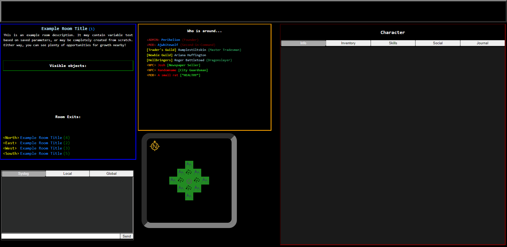

# umudserver
Universal MUD Server built in Node.js

## The Road So Far:

  The original online multiplayer experience for many of us was text-based Multi User Dungeons, alternatively referred to as Multi User Domains, among other names.  These were worlds mainly inspired by tabletop roleplaying games, such as Dungeons and Dragons, but eventually would grow to encompass fictional literary works and even historical settings!

  At the time, the number one biggest limitation was the available protocols, which was usually Telnet.  The reason why Telnet was such a limiting factor was not because it was text-based, however - even by this time, creative folks were utilizing the latest ANSI standards to provide compatible clients with colorful text and even text-based graphics!  No, the actual limitation of Telnet (and most client-server protocols of the era) was that you could only send or receive a single line of text at one time, usually limited to something like 80 characters.  Additionally, the processing hardware and the average connection speeds of the time meant that the process was like this:  Sending a line of data, waiting for the server to process the request, then waiting for the server to provide a response, then waiting for your client to receive and render the entire response, rinse and repeat, etc.  Also, the response was rendered in it's entirety, so whatever the server sent back would be directly displayed on the client's terminal.  

  We can easily avoid these problems today by using WebSockets.  With WebSockets, we can send JSON or even straight up Javascript Objects directly between client and server, with plenty of support for callbacks and other bits that we can use for creating a game server.  We can pass data such as combat events, updates to health status, etc. back and forth without having to display every single piece of data to the user.  This also means that we don't have to keep sending the same information repeatedly, but instead only when a change has occurred.  This is a massive improvement over the original MUD design, since status text had to be sent with virtually every message whether there were changes or not.

  But, you say, it's still just text you're working with!  True (actually, not necessarily), but we also can take advantage of something that MUDs couldn't - Cascading Style Sheets.  If we render our client on a Javascript-capable web browser, we can do a whole lot more than display ASCII art (although we can certainly do that too!).  In fact, with a combination of universal and embedded Unicode fonts, we have access to a plethora of icons, symbols, emoji, and other special characters, all of which render in the browser as quickly as regular text.  Some of these can even be used to create things like borders or frames, or to even make block text and pixel art!
  
  Want more?  You can always use regular graphics files for images, backgrounds, borders, etc.  You could use SVG files, or even create SVG objects on-the-fly!
  
  Still not enough???  Fine!  The client-server language is standardized and everything is served on a WebSocket - you can build your own client using whatever WebSocket-capable language or framework that you want, and just turn off the web server in the config!
  
  

  -----------------------------------------------------------------------------------------------------------------------------------------------------------------

### Main components:
  * /client - contains the HTML and javascript source to be served to clients
  * /server - contains the server files and scripts
  * #Database - Currently only supports MySQL backend for data storage
  
  Starting the server:
  /server/npm run devStart
  
  Starting the webserver:
  /client/npm run start
  
Current status of the project is WIP.  Client files are served by Snowpack.

The server is data-agnostic in order to accommodate the widest level of settings, genres and gameplay styles.  The plan is to include a default database with helpful information and templates to aid server admins and developers alike, and ultimately to allow the community to create their own server packs released under their own desired licensing.

--------------------------------------------------------------------------------------------------------------------------------------------------------------------

## To Do Next:
	- Disconnect MySQL after inactivity timeout
	- Standardize Websocket Commands

## Roadmap (Very subject to change!)

- Server
  - Command Handling
    - Permissions
  - Data Handling
  - Event Handling
- Client
  - Mapping
  - Event Handling
  - Local Storage
- Admin Panel
  - Users & Permissions
  - Rooms
  - Items
  - Regions
  - Events
  - NPCs
  - Mobs
